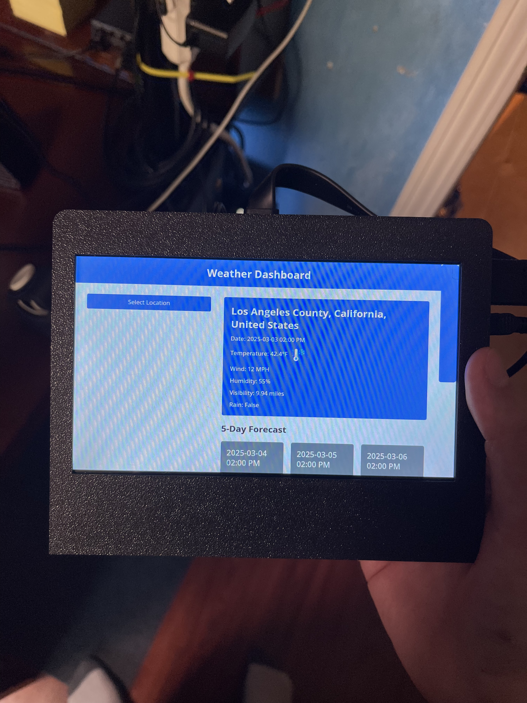
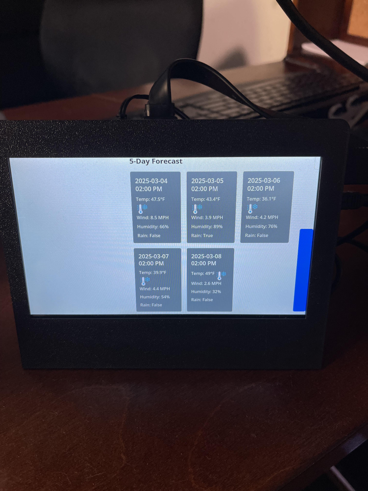

# 🌧️ Weather App ☀️

A user-friendly weather dashboard built with Flask that leverages the Tomorrow.io API to deliver real-time conditions and forecasts. This application features seamless location translation for international cities, interactive weather visualizations, and comprehensive meteorological data including temperature, precipitation, wind conditions, and more.

## Hardware Compatibility

This project is currently running on my Raspberry Pi 3 Model B with a 7-inch touch screen display (used to display the dashboard). However, it's designed to be platform-agnostic and should run on any machine that meets the prerequisites, not just Raspberry Pi devices.

## Features

- Displays real-time weather data
- Provides a 5-day weather forecast
- Supports location translation for international cities
- Displays weather icons and data like temperature, wind speed, humidity, visibility, and rain intensity

## Customizing Locations

If you wish to add or remove cities/places, modify the locations in the `templates/index.html` file. Locations should be in the element with the opening tag `<div class="dropdown-content">`

## Project Structure

```
weather_webapp/
├── api_endpoint_webapp.py       # Main application file
├── convert_to_12hour.py         # Needed by main application file
├── templates/
│   └── index.html               # Main page template
├── static/
│   └── img/                     # Contains weather-related icons
│   └── style.css                # Main page styles
│   └── script.js                # Main frontend JS file
├── logs/
│   └── weather_app.log          # Will be created when application runs.
├── .env                         # Environment variables (not in version control)
└── setup_venv.sh                # Sets up virtual environment
```

## Setup Instructions

### Prerequisites

- Python 3.x (check the `Pipfile` for the required version)
- pipenv (for managing dependencies)
- A Tomorrow.io account to get your own API key

### Installation

1. **Clone the repository**
   ```bash
   git clone https://github.com/JosephG0918/weather-dashboard.git
   cd weather-dashboard/src/weather_webapp
   ```

2. **Install dependencies**
   
   Make sure you have pipenv installed. If not, install it using:
   ```
   pip install pipenv
   ```
   or
   ```
   sudo apt install pipenv
   ```

   Run the setup script to create the virtual environment and install dependencies:
   ```
   chmod +x setup_venv.sh
   ./setup_venv.sh
   ```

   More info about pipenv [here](https://pypi.org/project/pipenv/)

3. **Configure environment variables**
   
   In the `/weather_webapp/` directory of the project, create a `.env` file (if it doesn't already exist) and add your Tomorrow.io API key:
   ```
   WEATHER_API_KEY=your_tomorrow_io_api_key
   ```

4. **Run the application**

   Make sure the virtual environment is activated before running the application:
   ```
   pipenv shell
   ```
   ```
   python api_endpoint_webapp.py
   ```

   The app will be running on `http://localhost:5000` or `http://0.0.0.0:5000`.
   
   **Note:** Make sure to append `/weather` at the end of the URL to access the weather dashboard.
   ```
   http://127.0.0.1:5000/weather
   ```

5. **Set up autostart**

   To run the application on reboot, create an autostart directory in `/home/user/.config/`
   ```
   mkdir /home/user/.config/autostart
   ```
   Place your `.desktop` files (`weather-backend.desktop`, `kiosk.desktop`) into this folder.

   `.desktop` files are located in the `/run_weather_dashboard/` directory.

   You need to edit the `weather-backend.desktop` file and replace placeholders like `user` and `venv` with real values.
   You can locate the `venv` (virtual environment) by executing:
   ```
   ls /home/user/.local/share/virtualenvs/
   ```

   Finally, reboot the system:
   ```
   sudo reboot -h now
   ```

   To confirm the web app is running:
   ```
   curl -I http://127.0.0.1:5000/weather
   ```

## Troubleshooting 🔧

- Check the logs (`logs/weather-app.log`) if errors occur
- Ensure your Tomorrow.io API key is valid and correctly configured in the `.env` file

## Security Feature

- Flask's session feature requires a secret_key to securely sign session cookies, ensuring that session data cannot be tampered with by the client.

## Credits

- Weather icons from [Flaticon](https://www.flaticon.com/free-icons/weather-forecast/3)
- Weather data provided by [Tomorrow.io](https://www.tomorrow.io/)
- Claude AI helping write this readme file.

## License

This project is licensed under the MIT License - see the [LICENSE](LICENSE) file for details.

---




